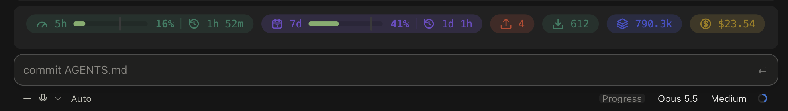

# Claude Code mods

## usage-band



A band of pills above the Claude Code prompt, drawn in the desktop app (the terminal gets one line of text):

- `5h` and `7d` rate-limit gauges with the percent used, a marker for how much of the window has passed, and the time until it resets
- session tokens: input (uncached), output, and cache read + write
- session cost in USD

Every pill is always drawn; a value with no reading yet shows `--` or `0`. Token totals count from when the mod loads, since the engine reports no running total.

It keeps whatever another mod draws in the same band and stacks it underneath, so it works next to [plan-progress](https://github.com/zycck/claude-mods). If plan-progress is loaded first in the chain, its bar can cover this band while it is open.

### Install

In Claude Code:

```
/plugin marketplace add Sh0ckWaveZero/claude-mods
/plugin install usage-band@sh0ck-mods
```

Together with plan-progress:

```
/plugin marketplace add zycck/claude-mods
/plugin install plan-progress@zycck-mods
```

Update:

```
claude plugin marketplace update sh0ck-mods
claude plugin update usage-band@sh0ck-mods
```

### Commands

- `/usage-band` shows or hides the band

### Theme

Colors follow the app theme, read once when the session starts: a dark theme gets lighter ink and a lighter track so text and the marker keep their contrast. Any other theme keeps the light look.

## License

MIT

Built with Claude Code mods (function hooks).
